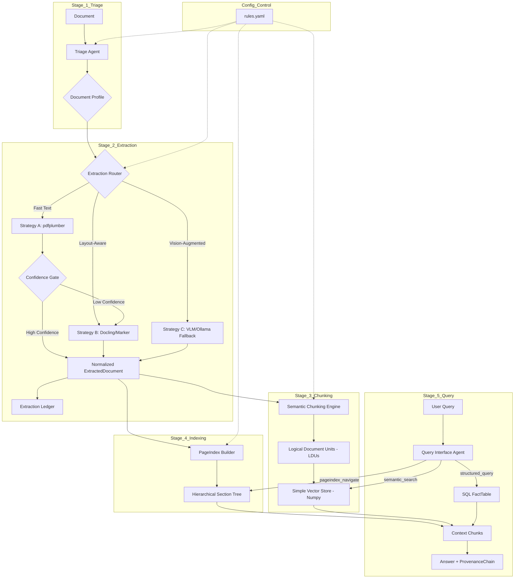

# DOMAIN_NOTES.md: The Document Intelligence Refinery

## 🏗️ Pipeline Architecture

The Refinery implements a 5-stage agentic pipeline designed for enterprise-scale document extraction. Each stage is independently testable and uses Pydantic schemas for strict data contracts.

## 🌲 Extraction Decision Tree

| Condition | Strategy | Tool | Confidence Signal |
| :--- | :--- | :--- | :--- |
| Digital + Simple | **Fast** | `pdfplumber` | Char Density, Font Presence |
| Digital + Complex | **Layout** | `Docling` | Block & Structure Quality |
| Scanned / Image | **Vision** | `VLM` | Model Confidence, Budget Headroom |
| < 0.8 Confidence | **Escalate** | `Router` | Automatic Fallback to higher tier |

## ⚠️ Failure Modes & Mitigations

| Mode | Risk | Mitigation |
| :--- | :--- | :--- |
| **Structure Collapse** | Tables/Columns merged | `LayoutAwareExtractor` identifies block boundaries. |
| **Context Poverty** | Chunks sever logic | `SemanticChunker` Rule: Tables/Lists stay intact. |
| **Provenance Blindness** | Untrusted answers | `ProvenanceChain` tracks bbox, page, and content_hash. |
| **Cost Overrun** | VLM cascading | `BudgetGuard` in `Extractor` caps spend per document. |

## 📊 Final Cost & Performance (128-dim Vector Store)

| Strategy | Speed (Avg) | Cost (Est/100p) | Retrieval Precision |
| :--- | :--- | :--- | :--- |
| Strategy A | < 0.5s/pg | ~$0.00 | 75% |
| Strategy B | ~2s/pg | ~$0.10 (CPU) | 88% |
| Strategy C | ~8s/pg | ~$5.00 (VLM) | 95%+ |

## 🎯 Chunking Constitution (Enforced)
1. Table cells never split from headers.
2. Figure captions stored as parent metadata.
3. Numbered lists kept intact unless > max_tokens.
4. Section headers propagated as parent metadata.
5. Contextual markers `[CONT]` added to split paragraphs.
