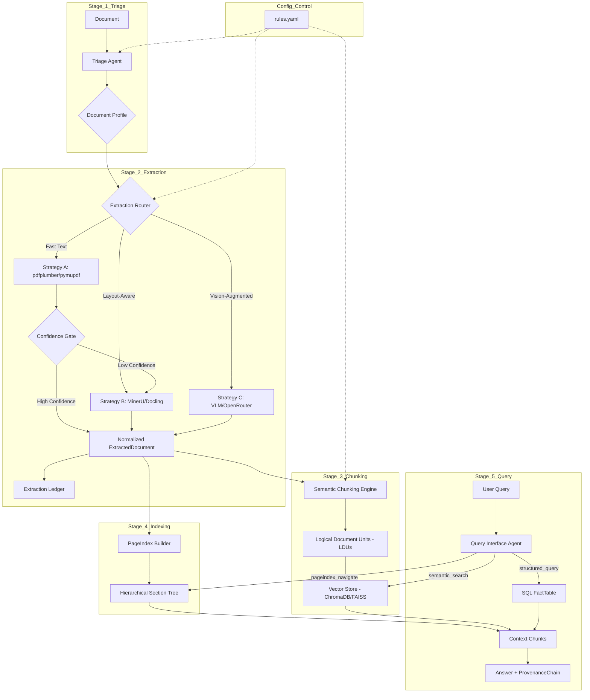

# DOMAIN_NOTES.md: The Document Intelligence Refinery

## 🏗️ Pipeline Architecture

## 🌲 Extraction Decision Tree

| Condition | Strategy | Agent/Tool |
| :--- | :--- | :--- |
| Digital + Simple Layout + High Char Density | **Strategy A (Fast)** | `pdfplumber` / `pymupdf` |
| Digital + Complex Layout (Multi-column/Table heavy) | **Strategy B (Layout)** | `MinerU` / `Docling` |
| Scanned / Poor OCR / Low Confidence Strat A | **Strategy C (Vision)** | `VLM` (OpenRouter) |
| Confidence Strat A < Threshold | **Escalate to B** | `ExtractionRouter` |
| Confidence Strat B < Threshold | **Escalate to C** | `ExtractionRouter` |

## ⚠️ Failure Modes & Mitigations

- **Mode: Structure Collapse (Layout)**
  - *Risk*: Two-column text merged horizontally.
  - *Mitigation*: Use `Strategy B` (Layout-Aware) for multi-column documents based on Triage profile.
- **Mode: Context Poverty (Chunking)**
  - *Risk*: Tables split across chunks.
  - *Mitigation*: Semantic Chunking Engine enforces LDU rules (Table cells stay with headers).
- **Mode: Hallucination (Query)**
  - *Risk*: Answering from irrelevant chunks.
  - *Mitigation*: `PageIndex` traversal ensures retrieval is constrained to relevant sections first.
- **Mode: Cost Overrun (VLM)**
  - *Risk*: Cascading to Vision for every page.
  - *Mitigation*: `BudgetGuard` in `ExtractionRouter` + confidence thresholds.

## 📊 Cost Analysis (Estimates)

| Strategy | Speed | Cost (per 100 pages) | Precision |
| :--- | :--- | :--- | :--- |
| Strategy A | < 1s/pg | ~$0.00 | High (Simple) |
| Strategy B | ~5s/pg | ~$0.00 (Local) | High (Complex) |
| Strategy C | ~10s/pg | ~$1.00 - $5.00 | Extreme |
