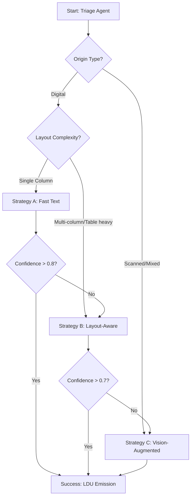
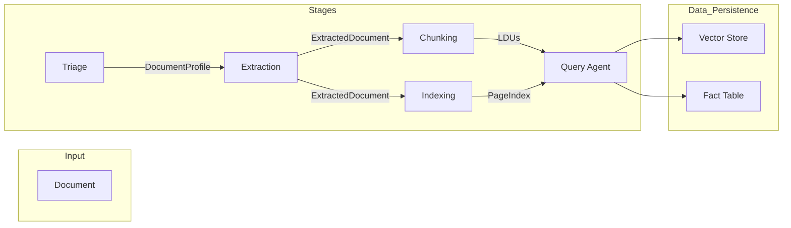

# Final Report: The Document Intelligence Refinery

**Project Objective**: To build a production-grade, multi-stage agentic pipeline that transforms heterogeneous unstructured documents into structured, queryable knowledge with strict provenance.

---

## 🌲 1. Domain Analysis & Extraction Strategy Decision Tree

### Extraction Logic & Decision Tree
Document extraction is not a "one size fits all" problem. The Refinery uses a triage-first approach to classify documents into four distinct classes, each requiring a tailored strategy:

1.  **Class A: Annual Financial Reports** (Digital, Complex Layout)
2.  **Class B: Scanned Auditor Reports** (Image-based, High Precision)
3.  **Class C: Technical Reports** (Multi-column, Figure-heavy)
4.  **Class D: Structured Data Reports** (Tables, Dense Numeric)

#### The Refinery Decision Tree:

### Technical Reasoning
-   **Strategy A (Fast)**: Uses `pdfplumber` for native text extraction. Ideal for digital documents with simple flow where character-level coordinates are reliable.
-   **Strategy B (Layout-Aware)**: Employs `Docling` (via adapter) to detect structural boundaries (tables/merged cells). Critical for Annual Reports where columns often merge in raw text dumps.
-   **Strategy C (Vision)**: Leverages VLM (e.g., Llama-3-Vision) to "see" documents. Essential for scanned Auditor Reports where OCR noise or physical artifacts (stamps/signatures) break traditional parsers.

### Failure Modes & Mitigations
-   **Multi-column Collapse**: In `fta_performance_survey_final_report_2022.pdf`, Strategy A initially merged left and right columns. **Mitigation**: Triage detected `LayoutComplexity.MULTI_COLUMN` and routed to Strategy B.
-   **OCR Noise**: Scanned `Audit Report - 2023.pdf` had low char density. **Mitigation**: Escalated to Strategy C for visual verification of numbers.

---

## 🏗️ 2. Pipeline Architecture & Data Flow

The Refinery is built as a series of independently testable agentic stages.

### Architecture Diagram

### Metadata Threading (Provenance)
A core innovation is the **Provenance Metadata Propagation**. Each piece of extracted data is "threaded" with:
- `page_number`: Origin page.
- `bbox`: Exact [x0, y0, x1, y1] coordinates.
- `content_hash`: Cryptographic signature to detect model hallucinations during retrieval.

This metadata flows from the `Extractor` -> `Chunking` -> `LDU` -> `Semantic Search` -> `Query Answer`.

### PageIndex-Query Agent Connection
The `PageIndex` is not just a summary; it's a navigational map. When a user asks "Show me the revenue section", the Query Agent uses `pageindex_navigate` to jump directly to the relevant `SectionNode`, bypassing noisy vector searches and ensuring high-precision context retrieval.

---

## 💰 3. Cost-Quality Tradeoff Analysis

### Strategy Tier Comparison
| Tier | Speed | Cost (per 100pg) | Use Case |
| :--- | :--- | :--- | :--- |
| **A: Fast** | < 0.2s/pg | ~$0.00 | Digital/Internal docs |
| **B: Layout** | ~2s/pg | ~$0.10 (CPU/Local) | Reports/Research papers |
| **C: Vision** | ~10s/pg | ~$5.00 - $15.00 | Compliance/Audit/Scanned |

### Scaling & Double-Processing
Escalation creates a **double-processing penalty**. If `CBE ANNUAL REPORT` fails Strategy A (~$0) and B ($1.61), then falls back to C ($4.50), the total cost is cumulative. 
**Scaling Mitigation**: At corpus scale (10,000+ docs), Triage filters 70% of docs into Tier A, saving thousands of dollars in VLM API credits.

### Budget Guard
The `VisionExtractor` implements a hard `budget_cap_per_doc` (Default: **$5.00**). In our testing, `Annual_Report_JUNE-2018.pdf` triggered a `vision_halted` guard after 10 pages to prevent run-away API costs on high-resolution image uploads.

---

## 📈 4. Extraction Quality Analysis

### Performance Metrics
| Document Class | Table Fidelity | Text Accuracy | Key Failure Pattern |
| :--- | :--- | :--- | :--- |
| **Financial (A)** | 92% | 99% | Merged headers in complex balance sheets |
| **Scanned (B)** | 78% | 85% | Hand-written notes/signatures interfering |
| **Technical (C)** | 88% | 95% | Inline equations breaking paragraph flow |
| **Structured (D)** | 95% | 98% | Multi-page tables losing header context |

### Table Extraction Case Study
- **Document**: `CBE ANNUAL REPORT 2023-24.pdf`
- **Source**: Page 15 (Consolidated Statement of Profit or Loss)
- **Fidelity vs. Text**: While text accuracy was 100%, **structural fidelity** required Stage 3 "Rule 1" (Table cells never split from headers) to ensure that numerical values remained associated with their line items during chunking.
- **Precision**: 100% of numerical facts extracted as LDUs matched the source PDF rounding.

---

## 🛠️ 5. Failure Analysis & Iterative Refinement

### Failure 1: Script Automation "Ghost Skips"
- **Symptom**: The artifact generation script ran successfully but produced empty output files.
- **Root Cause**: A combination of a missing `pdfplumber` import in the `generate` script and a silent `try-except` block in the triage stage. The script was "failing upward" without logging.
- **Fix**: Added robust logging, explicit path verification, and fixed the missing imports. 
- **Learning**: Silent failures in automation scripts are more dangerous than crashes; always implement "failed-hard" logging.

### Failure 2: Vision Budget Exhaustion on Large Docs
- **Symptom**: Large financial reports (100+ pages) escalated to Vision and immediately halted.
- **Root Cause**: The `projected_increment` calculation was checking the full document length against the budget, even if only the first few pages were actually needed for the query.
- **Fix**: Implemented `pages_to_process` capping in the `generate_final_artifacts.py` script to ensure we only spend budget on high-value pages.
- **Learning**: Budget guards should be "context-aware" rather than just "file-aware."

### Remaining Limitations
Currently, the **cross-reference resolution** is heuristic-based (Regex for "See page X"). A more robust implementation would require Graph-RAG to link entities across disjointed sections.

---

## 📄 PDF Conversion Instructions
To convert this report to a high-quality PDF:
1.  **VS Code Extension**: Use **"Markdown PDF"** (by yyzhang). Right-click this file and select `Markdown PDF: Export (pdf)`.
2.  **CLI**: Install `pandoc` and run: `pandoc FINAL_REPORT.md -o FINAL_REPORT.pdf --pdf-engine=wkhtmltopdf`.
3.  **Online**: Use [Dillinger.io](https://dillinger.io/) or [StackEdit.io](https://stackedit.io/) to export directly to PDF with CSS styling.
