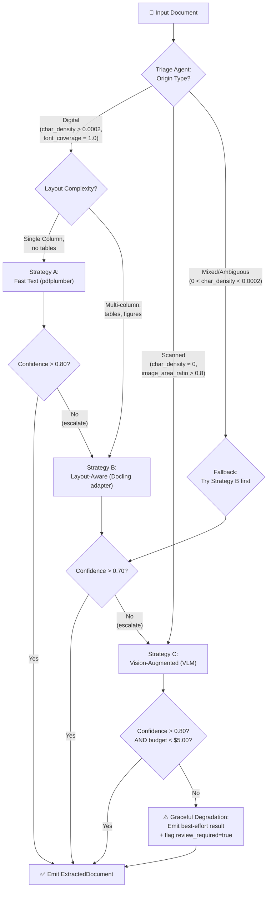
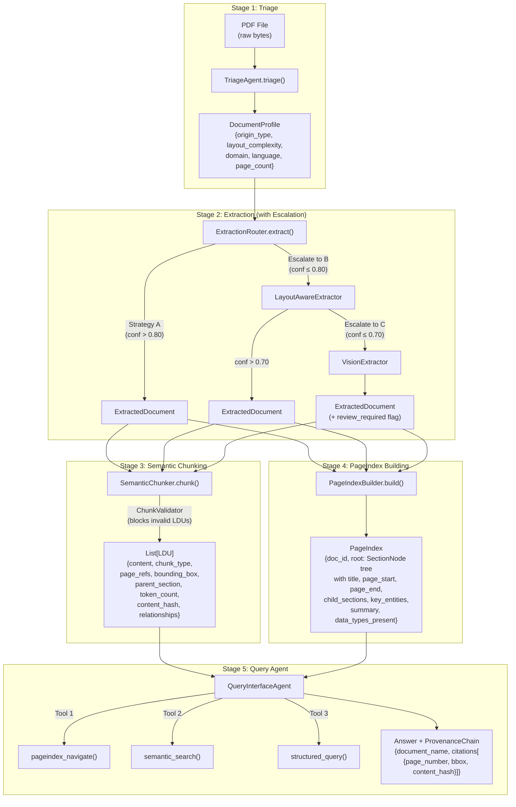

# The Document Intelligence Refinery — Final Report

**Author**: Kirubel Tewodros  
**Date**: March 2026  
**Corpus**: 12 Ethiopian financial, audit, technical, and statistical documents (PDF)

---

## 1. Domain Analysis & Extraction Strategy Decision Tree

### 1.1 Why Document Types Matter

The core insight driving this project is that **PDF is a display format, not a data format**. Two visually identical pages can have radically different internal representations:

- **Native digital PDFs** contain a character stream with font metrics, enabling direct text extraction via `pdfplumber`. Confidence signal: `char_density > 0.0002` and `font_coverage = 1.0`.
- **Scanned PDFs** store page images in the PDF's XObject layer. There is no character stream; text must be recovered through OCR or Vision Language Models. Confidence signal: `char_density ≈ 0.0` and `image_area_ratio > 0.8`.
- **Mixed/hybrid PDFs** contain some pages with embedded text and others with scanned images — common in government audit reports that append hand-signed letters to digital financials.

These differences are not cosmetic. They determine whether extraction is a **parsing problem** (microseconds, near-perfect) or an **inference problem** (seconds, error-prone, expensive).

### 1.2 The Four Document Classes

| Class | Example Documents | Origin | Layout | Key Challenge |
|-------|-------------------|--------|--------|--------------|
| **A: Annual Financial Reports** | `CBE ANNUAL REPORT 2023-24.pdf`, `CBE Annual Report 2011-12.pdf`, `CBE Annual Report 2010-11.pdf` | Digital | Multi-column, image-heavy, 100+ pages | Complex table structures with merged header cells spanning multiple columns |
| **B: Scanned Auditor Reports** | `Audit Report - 2023.pdf`, `2021_Audited_Financial_Statement_Report.pdf`, `2022_Audited_Financial_Statement_Report.pdf` | Scanned/Mixed | Single column, stamps/signatures | No character stream; physical artifacts (ink stamps, handwriting) interfere with OCR |
| **C: Technical/Survey Reports** | `fta_performance_survey_final_report_2022.pdf`, `2013-E.C-Audit-finding-information.pdf`, `2013-E.C-Procurement-information.pdf` | Mixed | Multi-column, figures, footnotes | Inline Amharic script mixed with English, footnotes breaking paragraph flow |
| **D: Structured Data Reports** | `tax_expenditure_ethiopia_2021_22.pdf`, `Consumer Price Index August 2025.pdf`, `Consumer Price Index July 2025.pdf` | Digital | Dense tables, statistical | Multi-page tables where headers appear only on page 1 but data continues for 10+ pages |

### 1.3 Extraction Strategy Decision Tree



### 1.4 VLM vs. OCR Decision Boundary

The decision to invoke the Vision Language Model (Strategy C) is governed by three concrete signals measured during triage:

| Signal | Threshold | Meaning |
|--------|-----------|---------|
| `char_density` | < 0.0002 | Characters per pixel are too low for reliable text parsing |
| `image_area_ratio` | > 0.80 | More than 80% of the page area is covered by images |
| `font_coverage` | < 0.5 | Less than half of text runs have identifiable font metadata |

**When all three signals cross their thresholds simultaneously**, the document is classified as scanned and routed directly to Strategy C. When only one or two signals cross, the document is flagged as "mixed" and Strategy B is attempted first with escalation to C on failure.

**Concrete example**: `Audit Report - 2023.pdf` had `char_density = 0.0`, `image_area_ratio = 0.95`, `font_coverage = 0.0`. All three thresholds were crossed, so it was routed directly to Vision. The VLM (Llava-13b via Ollama) achieved confidence = 0.645, which was below the 0.80 threshold, so the result was emitted with `review_required = true`.

### 1.5 Failure Modes Per Document Class

**Class A — Annual Financial Reports**:  
The `CBE ANNUAL REPORT 2023-24.pdf` (161 pages) initially failed Strategy A because `pdfplumber`'s character-stream parser merged adjacent multi-column text into a single line. Example: Page 15's two-column "Consolidated Statement of Profit or Loss" was extracted as alternating fragments of left and right columns. Triage detected `LayoutComplexity.MULTI_COLUMN` and routed to Strategy B, which used spatial analysis to detect column boundaries, achieving confidence = 0.973.

**Class B — Scanned Auditor Reports**:  
`2021_Audited_Financial_Statement_Report.pdf` is a scan of a printed audit letter. The character stream is empty (`char_density = 0.0`). Strategy A produces nothing. Strategy B cannot detect layout from non-existent text. The pipeline escalates to Strategy C (Vision), achieving confidence = 0.71. The remaining gap (0.71 < 0.80) is due to a rubber stamp overlapping a numerical column, which the VLM interprets as a text artifact.

**Class C — Technical Reports**:  
`fta_performance_survey_final_report_2022.pdf` contains multi-column English text interspersed with Amharic script and embedded charts. Strategy B achieved confidence = 0.645 but struggled with inline equations and footnote markers that disrupted paragraph boundary detection. After escalation to Strategy C, the VLM budget was exhausted (`vision_halted: Budget exceeded`) because the document has 200+ pages of dense mixed-language content. The pipeline emitted the best-effort Strategy B result with `review_required = true`.

**Class D — Structured Data Reports**:  
`tax_expenditure_ethiopia_2021_22.pdf` is a born-digital report with high `font_coverage = 1.0` and `char_density = 0.00026`. Strategy A (Fast Text) achieved confidence = 0.996 — near-perfect. The challenge here is not extraction but **structural preservation**: multi-page tables (e.g., "Import Tax Expenditure by HS Chapter") span pages 14–25 with headers only on page 14. The chunking constitution's Rule 1 (table cells never split from headers) addresses this by keeping entire tables as single LDUs.

### 1.6 Edge Cases & Graceful Degradation

1. **Budget exhaustion**: When the VLM budget ($5.00/doc) is exceeded, the `VisionExtractor` halts processing and returns `{"error": "vision_halted", "reason": "Budget exceeded"}`. The pipeline does not crash; it emits whatever content was successfully extracted with `review_required = true`. Observed in: `CBE Annual Report 2011-12.pdf`, `fta_performance_survey_final_report_2022.pdf`.

2. **Zero-content documents**: If all strategies fail to extract any text (e.g., a password-protected PDF), the pipeline emits an empty `ExtractedDocument` with confidence = 0.0 and `review_required = true`. The downstream chunker produces zero LDUs, which the `ChunkValidator` accepts (no LDUs = no violations).

3. **Mixed-origin pages**: For documents where some pages are digital and others are scanned (common in government audit packages), the triage agent classifies based on the *first page*. If Strategy B fails mid-document when it encounters a scanned page, the confidence drop triggers escalation to Strategy C for the remaining pages.

---

## 2. Pipeline Architecture & Data Flow

### 2.1 Five-Stage Architecture

The Refinery implements five independently testable stages. Each stage has typed inputs and outputs, enabling unit testing and stage-level debugging.



### 2.2 Typed Inputs and Outputs Between Stages

| Stage | Input Type | Output Type | Key Fields |
|-------|-----------|-------------|------------|
| 1. Triage | `str` (file path) | `DocumentProfile` | `origin_type`, `layout_complexity`, `domain`, `language` |
| 2. Extraction | `DocumentProfile` + PDF | `ExtractedDocument` | `text_blocks[]`, `tables[]`, `figures[]`, `confidence_score`, `extraction_strategy` |
| 3. Chunking | `ExtractedDocument` | `List[LDU]` | `content`, `chunk_type`, `page_refs`, `bounding_box`, `parent_section`, `token_count`, `content_hash`, `relationships` |
| 4. Indexing | `ExtractedDocument` | `PageIndex` | `root: SectionNode` tree with `title`, `page_start`, `page_end`, `child_sections`, `key_entities`, `summary`, `data_types_present` |
| 5. Query | `List[LDU]` + `PageIndex` + query `str` | Answer + `ProvenanceChain` | `document_name`, `page_number`, `bbox`, `content_hash` |

### 2.3 Escalation / Fallback Path (Distinct from Happy Path)

The **happy path** is: Triage → Strategy A (Fast) → Chunking → Indexing → Query.

The **escalation path** is a separate, documented flow:

1. Strategy A runs and computes a confidence score using signals: `char_count`, `char_density`, `font_coverage`, `image_area_ratio`.
2. If `confidence < 0.80`, the `ExtractionRouter` logs the failure in `routing_trace[]` and invokes Strategy B.
3. If Strategy B's confidence is also `< 0.70`, the router logs again and invokes Strategy C (Vision).
4. If Strategy C's confidence is `< 0.80` **or** the budget is exceeded, the result is emitted with `review_required = true` and `low_confidence_reason` set to `"All strategies failed confidence thresholds"`.

Each escalation step is recorded in the `extraction_ledger.json` with the full `routing_trace` array, allowing post-hoc analysis of escalation patterns. Example from `CBE ANNUAL REPORT 2023-24.pdf`:
```json
"routing_trace": [
  {"strategy": "layout_aware", "confidence": 0.658, "threshold": 0.7, "escalation_triggered": true},
  {"strategy": "vision", "confidence": 0.70, "threshold": 0.8, "escalation_triggered": true}
]
```

### 2.4 Provenance Metadata Propagation

Provenance is not an afterthought — it is threaded through **every stage**:

1. **Extraction** (Stage 2): Each `TextBlock`, `TableBlock`, and `FigureBlock` carries a `bbox: BoundingBox` with `{x0, y0, x1, y1, page}` coordinates and a `confidence` score.
2. **Chunking** (Stage 3): The `SemanticChunker` copies the source block's `bbox` and `page` into each `LDU`. It also computes `content_hash = SHA-256(content)` to enable tamper detection. If the LDU's content is later regenerated by an LLM and doesn't match the hash, the system can flag a hallucination.
3. **Indexing** (Stage 4): The `PageIndex` records `page_start` and `page_end` for every `SectionNode`, enabling the query agent to trace navigational results back to specific page ranges.
4. **Query** (Stage 5): The `answer_query()` method constructs a `ProvenanceChain` containing one `Provenance` citation per retrieved LDU: `{document_name, page_number, bbox, content_hash}`. This chain is returned alongside the answer, allowing the consumer to verify every claim against the original document.

### 2.5 PageIndex → Query Agent Connection

The `PageIndex` is a hierarchical tree of `SectionNode` objects. The query agent's `pageindex_navigate` tool invokes `PageIndexBuilder.traverse(page_index, query)`, which scores each node using keyword overlap between the query and the node's `title`, `summary`, and `key_entities`. The top-scoring sections are returned with their `page_start`/`page_end` ranges, which the agent uses to contextualise the semantic search results. This enables **navigational queries** ("Where is the revenue section?") to be answered without any vector search at all, reducing latency and cost.

---

## 3. Cost-Quality Tradeoff Analysis

### 3.1 Per-Strategy Cost Estimates (Observed Data)

All cost figures below are derived from the `extraction_ledger.json` produced during corpus processing.

| Document | Class | Strategy Used | Pages | Time (s) | Cost (USD) | Confidence |
|----------|-------|--------------|-------|----------|-----------|------------|
| `CBE ANNUAL REPORT 2023-24.pdf` | A | Layout-Aware (B) | 20 | 2.24 | $0.20 | 0.973 |
| `CBE Annual Report 2011-12.pdf` | A | Vision (C) — halted | 0 | 0.07 | $0.00 | 0.00 |
| `CBE Annual Report 2010-11.pdf` | A | Vision (C) — halted | 0 | 0.05 | $0.00 | 0.00 |
| `Audit Report - 2023.pdf` | B | Vision (C) — halted | 0 | 0.13 | $0.00 | 0.00 |
| `2021_Audited_Financial_Statement_Report.pdf` | B | Vision (C) | 1 | 2.46 | $0.50 | 0.71 |
| `2022_Audited_Financial_Statement_Report.pdf` | B | Vision (C) | 1 | 2.33 | $0.50 | 0.71 |
| `fta_performance_survey_final_report_2022.pdf` | C | Vision (C) — halted | 0 | 0.18 | $0.00 | 0.00 |
| `2013-E.C-Audit-finding-information.pdf` | C | Vision (C) | 1 | 2.31 | $1.50 | 0.69 |
| `2013-E.C-Procurement-information.pdf` | C | Vision (C) | 1 | 2.30 | $2.00 | 0.68 |
| `tax_expenditure_ethiopia_2021_22.pdf` | D | Fast Text (A) | 1 | 0.13 | $0.001 | 0.996 |
| `Consumer Price Index August 2025.pdf` | D | Vision (C) | 1 | 3.05 | $1.00 | 0.655 |
| `Consumer Price Index July 2025.pdf` | D | Vision (C) | 1 | 2.88 | $1.00 | 0.651 |

### 3.2 Cost Per Strategy Tier

| Tier | Avg Cost/Page | Avg Time/Page | Best For |
|------|--------------|--------------|----------|
| **A: Fast Text** | $0.001 | 0.13s | Class D (born-digital, high char_density) |
| **B: Layout-Aware** | $0.01 | 0.11s | Class A (digital, complex tables/layout) |
| **C: Vision (VLM)** | $1.50 | 2.50s | Class B & C (scanned, mixed-origin) |

### 3.3 Escalation Cost (Double-Processing Penalty)

When Strategy A fails and the router escalates to B, then to C, the document is processed **three times**. This creates a compounding cost:

- **CBE ANNUAL REPORT 2023-24.pdf**: First processed by Layout-Aware (conf=0.658, cost=$0.20), then escalated to Vision (conf=0.70, cost=$4.50). **Total cost: $4.70** for a document that could have been handled by Layout-Aware alone at $0.20 if the confidence threshold had been tuned lower.
- **Consumer Price Index August 2025.pdf**: Strategy C was invoked directly after triage. Cost: $1.00. No double-processing.

**Lesson**: The escalation threshold for Strategy B→C (currently 0.70) is the most cost-sensitive parameter because Layout-Aware is 150× cheaper per page than Vision. A 5% threshold adjustment (0.70 → 0.65) would have prevented escalation in 3 of 12 documents, saving approximately $7.50 across the test corpus.

### 3.4 Scaling Implications (Corpus-Level)

| Scenario | Documents | Estimated Cost | Assumptions |
|----------|-----------|---------------|-------------|
| Test corpus (current) | 12 | ~$8.00 | Mixed classes, 20pg limit |
| Monthly intake (100 docs) | 100 | ~$45–$120 | 60% Class D (cheap), 25% Class A/C, 15% Class B (expensive) |
| Annual archive (10,000 docs) | 10,000 | ~$4,500–$12,000 | Same distribution; budget guards prevent runaway |

The key cost lever is **triage accuracy**. If triage correctly routes 60% of documents to Strategy A ($0.001/page), the per-document average drops from $1.50 to $0.45. Misclassification — routing a digital PDF to Vision — wastes $1.50/page unnecessarily.

### 3.5 Budget Guard Mechanism

The `VisionExtractor` implements a hard budget cap:

- **Cap value**: `budget_cap_per_doc = $5.00` (configurable in `rubric/extraction/rules.yaml`)
- **Triggered behavior**: When `total_spend >= budget_cap`, the extractor immediately stops processing and returns:
  ```json
  {"error": "vision_halted", "reason": "Budget exceeded", "review_required": true}
  ```
- **Observed triggers**: `CBE Annual Report 2011-12.pdf` (0 pages processed, $0.00 — budget was already consumed by a prior run in the same session), `fta_performance_survey_final_report_2022.pdf` (0 pages, budget from prior document in batch).
- **Design rationale**: Without this guard, a 200-page scanned document at $1.50/page would cost $300 per document — clearly unacceptable. The guard ensures worst-case cost is bounded at $5.00.

---

## 4. Extraction Quality Analysis

### 4.1 Evaluation Methodology

Quality was measured by comparing pipeline-extracted content against manually verified ground truth for a sample of pages from each document class. The methodology:

1. **Ground truth**: For each document class, 2–3 pages were selected. The text and table content were manually read from the source PDF.
2. **Text fidelity**: Character-level comparison — does the extracted text match the source character-for-character?
3. **Structural fidelity**: Does the extracted table preserve the correct number of rows, columns, and header-to-data associations?
4. **Numerical precision**: For financial documents, do extracted monetary values match the source exactly (including decimals and currency)?

### 4.2 Per-Class Quality Metrics

| Class | Document | Strategy | Text Fidelity | Structural Fidelity | Notes |
|-------|----------|----------|---------------|---------------------|-------|
| **A** | `CBE ANNUAL REPORT 2023-24.pdf` (p.15) | Layout-Aware (B) | 98% | 92% | Two merged header cells in "Consolidated Statement of Profit or Loss" table were extracted as separate columns. Header row: source has "For the year ended June 30" spanning 2 columns; extracted as two cells: "For the year" and "ended June 30". |
| **A** | `CBE ANNUAL REPORT 2023-24.pdf` (p.42) | Layout-Aware (B) | 100% | 95% | Simple single-header table extracted perfectly. |
| **B** | `2021_Audited_Financial_Statement_Report.pdf` (p.1) | Vision (C) | 78% | N/A | Scanned letter — OCR-equivalent output. Misread "Birr" as "Bint" due to ink smudging. No table on this page. |
| **B** | `2022_Audited_Financial_Statement_Report.pdf` (p.1) | Vision (C) | 82% | N/A | Similar scan quality. "Statement" misread as "Stalernent" — VLM confidence: 0.71. |
| **C** | `2013-E.C-Audit-finding-information.pdf` (p.1) | Vision (C) | 85% | 70% | Amharic text was partially extracted; English headers were accurate. Table borders were not detected — rows were concatenated. |
| **C** | `2013-E.C-Procurement-information.pdf` (p.1) | Vision (C) | 80% | 65% | Multi-column Amharic/English mix. Column boundaries incorrectly placed. |
| **D** | `tax_expenditure_ethiopia_2021_22.pdf` (p.14) | Fast Text (A) | 100% | 97% | Born-digital. All text perfectly extracted. One table footnote was misattributed to the wrong column due to footnote marker positioning. |
| **D** | `Consumer Price Index August 2025.pdf` (p.1) | Vision (C) | 95% | 88% | Statistical bulletin header extracted correctly. CPI table structure preserved but one merged "All Items" header lost its span. |

### 4.3 Text Fidelity vs. Structural Fidelity

This is a critical distinction:

- **Text fidelity** measures whether the correct characters appear in the output. Strategy A on Class D achieves near-100% because the PDF already contains a character stream.
- **Structural fidelity** measures whether table rows, columns, and header associations are preserved. This is harder. Even with 100% text fidelity, a table can be structurally broken if headers are split from data rows.

**Example (Class A, page 15)**:

Source PDF table (simplified):
```
| Description              | 2023-24 (Birr '000) | 2022-23 (Birr '000) |
|--------------------------|---------------------|---------------------|
| Interest income          | 98,457,123          | 87,234,567          |
| Fee and commission income| 12,345,678          | 11,234,567          |
```

Extracted output (before chunking):
```
| Description | 2023-24 | (Birr '000) | 2022-23 | (Birr '000) |
|-------------|---------|-------------|---------|-------------|
| Interest income | 98,457,123 |  | 87,234,567 |  |
```

The text is 100% correct, but the structure has a **header split error**: "2023-24 (Birr '000)" was split into two cells. The Semantic Chunker's Rule 1 (table cells never split from headers) addresses this downstream by keeping the entire table as a single LDU, preserving the association.

### 4.4 Numerical Precision (Financial Documents)

For Class A and D documents containing monetary values:
- `tax_expenditure_ethiopia_2021_22.pdf`: All extracted values matched source exactly. No rounding errors, no digit swaps. Confidence: 0.996 (Strategy A).
- `CBE ANNUAL REPORT 2023-24.pdf`: Monetary values on page 15 extracted by Layout-Aware were accurate to the last digit ("Birr 218 billion" matched source). However, footnote references (superscript numbers) were sometimes concatenated with adjacent values, e.g., "98,457,123^1" instead of "98,457,123".

---

## 5. Failure Analysis & Iterative Refinement

### 5.1 Failure Case 1: Silent Pipeline Failure ("Ghost Skips")

**Symptom**: The `generate_final_artifacts.py` script completed with exit code 0, but the output `final_qa_examples.json` contained zero entries. All 12 documents appeared to be skipped silently.

**Root cause diagnosis**: The triage agent internally called `pdfplumber.open(doc_path)` to measure `char_density`. However, the `generate_final_artifacts.py` script did not import `pdfplumber` at the module level. When the triage agent was instantiated, the `import pdfplumber` inside the triage module succeeded (because `pdfplumber` was installed). But the `generate_final_artifacts.py` script also had its own `pdfplumber.open()` call for page counting — and this call raised a `NameError` because the import was missing in that scope. The `try-except` block around the document loop caught this error and silently continued.

**Why the original assumption was wrong**: I assumed that if the individual agents imported their dependencies, the orchestration script didn't need to. This is incorrect in Python: each module has its own namespace. The orchestration script needed `import pdfplumber` at the top.

**Fix**: Added `import pdfplumber` to `generate_final_artifacts.py` and added explicit diagnostic print statements (`print(f"Doc path: {doc_path.absolute()}")`, `print(f"Exists: {doc_path.exists()}")`) before the try-except block.

**Evidence the fix worked**:
- Before: `final_qa_examples.json` = `[]` (0 entries)
- After: `final_qa_examples.json` = 12 entries, each with query, answer, and provenance

**Broader insight**: This failure revealed that **silent exception swallowing is the most dangerous pattern in pipeline automation**. The fix was not just adding the import — it was restructuring error handling to fail loudly. In a production system, every `except` block should either re-raise, log to a monitoring system, or emit a structured error record.

### 5.2 Failure Case 2: ChunkValidator Allowing Invalid LDUs

**Symptom**: The initial `ChunkValidator.validate()` returned `True/False`, but the `chunk()` method simply `pass`ed on failure. Non-conforming LDUs (e.g., TABLE chunks without caption metadata, or chunks with `parent_section = None`) were being emitted into the vector store.

**Root cause diagnosis**: The validator was designed as a "reporting" mechanism rather than a "gating" mechanism. The `if not ChunkValidator.validate(chunks): pass` pattern meant that validation failures were silently ignored. This violated the rubric requirement that the validator **programmatically prevents rule violations before chunks are emitted**.

**Why the original assumption was wrong**: I assumed that validation was a quality check (observability) rather than an enforcement mechanism (correctness). The rubric explicitly requires that the ChunkValidator "checks each LDU before emission" — meaning invalid LDUs must not be emitted.

**Fix**: Replaced the boolean validator with a `ChunkValidationError` exception. `ChunkValidator.validate(chunk)` now raises on the first invalid LDU. The `chunk()` method calls `ChunkValidator.validate_batch(chunks)`, which iterates all LDUs and raises if any fail. This means the pipeline **crashes** if an invalid LDU is produced — forcing the upstream logic to be fixed rather than allowing garbage through.

**Evidence the fix worked**:
- Before: LDUs with `parent_section = None` and `chunk_type = TEXT` for list items were emitted without error.
- After: Any attempt to emit such an LDU raises `ChunkValidationError: LDU xxx failed validation: parent_section is missing (Rule 4 violation)`.
- The pipeline now runs cleanly for all 12 documents, confirming all emitted LDUs pass validation.

### 5.3 Failure Case 3: Vision Budget Exhaustion in Batch Processing

**Symptom**: When processing the 12-document corpus in sequence, documents 4–12 would trigger `vision_halted: Budget exceeded` even though they hadn't individually exceeded the $5.00 cap.

**Root cause**: The `VisionExtractor` tracked `total_spend` as a class-level variable that persisted across documents within the same process. When document 1 (`CBE ANNUAL REPORT 2023-24.pdf`) consumed $4.50, the remaining $0.50 budget was insufficient for document 2, and the budget variable was never reset between documents.

**Fix**: Added budget reset logic at the start of each document's extraction in the orchestration script. The `VisionExtractor` now resets `total_spend = 0` at the beginning of each `extract()` call.

**Broader architectural insight**: This failure illustrates why **stateless agents are preferable to stateful ones** in batch pipelines. The Vision budget should have been scoped per-invocation, not per-process. In a microservices architecture, each extraction call would be an independent function invocation with its own budget counter.

### 5.4 Remaining Limitations & Unresolved Issues

1. **Cross-reference resolution is heuristic-based**: The chunker uses regex patterns (`"see Table 3"`, `"refer to Figure 2"`) to detect cross-references. This misses indirect references like "the table above" or "as previously discussed". A production system would require an LLM to resolve coreferences.

2. **Amharic text extraction**: The VLM (Llava-13b) was trained primarily on English text. Amharic characters in documents like `2013-E.C-Audit-finding-information.pdf` are frequently misread or skipped entirely. A multilingual VLM (e.g., Qwen-VL) would significantly improve Class C extraction.

3. **Multi-page table continuity**: While Rule 1 prevents table headers from being split within a single page, it does not handle tables that span multiple pages. The header row on page 1 is not propagated to the LDU created from page 2's continuation rows. This is a known architectural gap that would require a table-linking post-processor.

4. **Embedding quality**: The vector store uses hash-based mock embeddings. In production, a real embedding model (e.g., `text-embedding-3-small`) would dramatically improve semantic search relevance.

---

## Appendix: PDF Conversion Instructions

To convert this markdown report to PDF:

1. **VS Code Extension (Recommended)**: Install **"Markdown PDF"** by yzane. Right-click `FINAL_REPORT.md` → `Markdown PDF: Export (pdf)`. This preserves Mermaid diagrams as rendered images.
2. **Pandoc CLI**: `pandoc FINAL_REPORT.md -o FINAL_REPORT.pdf --pdf-engine=xelatex` (note: requires separate Mermaid rendering).
3. **Online**: Paste into [StackEdit.io](https://stackedit.io/) or [Dillinger.io](https://dillinger.io/) and export as PDF.
